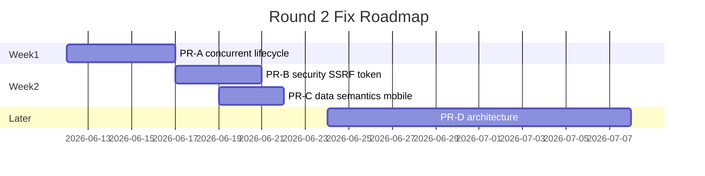

# Round 2 修复实施计划（PR-A / PR-B / PR-C）

基于第二轮审计去重后的 P0/P1 项。预估工期为单人全职；可并行拆分。

---

## PR-A：P0 并发与生命周期（3–5 天）

### 目标
消除并行竞态、统一 Orchestrator 生命周期、完善进程关闭链。

### 文件级 Task List

| # | 文件 | 改动 |
|---|------|------|
| A1 | `backend/app/orchestration/handlers/step_scheduler_handler.py` | `_launch_ready_steps` 每 step 使用 `copy.deepcopy(context)` 或独立 context factory |
| A2 | `backend/app/orchestration/resource_state.py` | `_TASK_READ_STATES` 键改为 `(task_id, step_id, path)`；任务终态 `clear_task_read_states` |
| A3 | `backend/app/orchestration/os_execution_engine.py` | `run_plan_turn`/`process_plan` 统一 `_orchestrator_for_state`；`cancel_run` 维护并 cancel `run_id→tasks`；并行 fatal 时 cancel 兄弟 task |
| A4 | `backend/app/services/run_service.py` | `EngineRouter` 按 run 注入 OSExecutionEngine factory，禁止全局单例 |
| A5 | `backend/app/orchestration/tool_runtime.py` | dry-run 仍持路径读锁；`asyncio.wait_for` 包裹 `_execute_tool_body`（配置 `tool_timeout_seconds`） |
| A6 | `backend/app/main.py` | lifespan finally 增加 `await get_pool().shutdown()` |
| A7 | `backend/app/services/scheduler_service.py` | `stop()` await `_executions`（带超时） |
| A8 | `desktop/src/main/main.ts` | `before-quit` 先 `enterBackground()` 再 `backend.stop()` |
| A9 | `backend/app/agents/orchestrator_agent.py` | 引入 `OrchestratorRegistry`（按 task_id/run_id 缓存） |
| A10 | `backend/app/orchestration/agent_bus.py` | 订阅表改为实例字段 |

### 测试补齐

| 新测试文件 | 覆盖 |
|-----------|------|
| `backend/tests/test_parallel_context_isolation.py` | 两并行 step 不共享 extra_context / read_states |
| `backend/tests/test_lifespan_shutdown.py` | mock TaskPool，断言 shutdown 被调用 |
| `backend/tests/test_tool_timeout.py` | 慢工具触发 timeout 失败 |
| `backend/tests/test_cancel_run_drains_tasks.py` | cancel_run 后无在途 execute |
| `backend/tests/test_orchestrator_registry.py` | 同 task 复用 orchestrator，不同 task 隔离 |

### 验收标准
- `pytest backend/tests/test_parallel_* backend/tests/test_tool_timeout.py backend/tests/test_cancel_run*` 全绿
- 并发双 OS run 集成测试无交叉污染

---

## PR-B：P0/P1 安全面（2–4 天）

### 目标
统一出站 SSRF 防护、加固 token/配对、诊断脱敏。

### 文件级 Task List

| # | 文件 | 改动 |
|---|------|------|
| B1 | `backend/app/mcp/client.py` | URL 校验（scheme + 私网/metadata 阻断）；`follow_redirects=False`；注入 `Authorization` |
| B2 | `backend/app/llm/openai_compatible.py` | cloud 模式 `_post_json` 出站 URL 校验 |
| B3 | `backend/app/llm/registry.py` | `_build_cloud_provider` 增加 base_url 安全校验 |
| B4 | `backend/app/adapters/webhook.py` | 复用 browser SSRF 校验函数 |
| B5 | `backend/app/security/desktop_api.py` | token 创建走 `local_secret._write_secret_file` DPAPI |
| B6 | `desktop/src/main/desktopApiToken.ts` | 读取 DPAPI 加密 token |
| B7 | `backend/app/services/mobile_pairing_service.py` | `token_hex(4)` 或 8 字符；全局 pairing 失败限速 |
| B8 | `backend/app/api/routes_system.py` | GET diagnostics 复用 export 脱敏 |
| B9 | `backend/app/api/routes_audit.py` | audit payload `redact_value` |
| B10 | `backend/app/api/routes_approvals.py` | 异常 detail 脱敏 |
| B11 | `backend/app/policy/permissions.py` | 无 allow 规则时默认 deny（或显式 opt-in） |
| B12 | `desktop/electron-builder.yml` | `verifyUpdateCodeSignature: true` |
| B13 | `desktop/src/renderer/lib/apiClient.ts` | dev:web 注入 dev token 或禁用写 API |

### 测试补齐

| 文件 | 覆盖 |
|------|------|
| `backend/tests/test_mcp_ssrf.py` | 私网/metadata URL 拒绝 |
| `backend/tests/test_cloud_llm_ssrf.py` | cloud base_url RFC1918 阻断 |
| `backend/tests/test_system_diagnostics.py` | GET 路径脱敏断言 |
| 扩展 `test_mobile_pairing.py` | 更长配对码 + 全局限速 |

### 验收标准
- MCP/LLM/Webhook 私网 URL 一律 4xx
- `npm run audit:deps` desktop critical 升级 concurrently/shell-quote

---

## PR-C：P1 数据语义与契约（2–3 天）

### 目标
修复 DB 语义、状态机默认、移动端契约缺口。

### 文件级 Task List

| # | 文件 | 改动 |
|---|------|------|
| C1 | `backend/app/core/db.py` | `_upsert_plans` 改 ON CONFLICT 保留 `created_at` |
| C2 | `backend/app/config.py` | 默认 `strict_state_machine=True`（或非法迁移不写入） |
| C3 | `backend/app/orchestration/state_machine.py` | non-strict 模式：审计但不改 status |
| C4 | `backend/app/orchestration/handlers/step_scheduler_handler.py` | 全 SKIPPED 标 `PARTIAL` 或检查 blocked_dependency |
| C5 | `backend/app/core/schemas.py` | 引入 `TaskPhase.DENIED` 或独立 stage |
| C6 | `mobile/src/api/client.ts` | `fetchWithTimeout` 统一封装（15–30s） |
| C7 | `mobile/src/screens/` | wakeup 列表 + 审批 UI（对接 `/api/mobile/wakeups/*`） |
| C8 | `mobile/src/store/auth.ts` | legacy token 迁移后擦除 AsyncStorage |
| C9 | `scripts/install_acceleration.ps1` | `auto` 探测后只装一种 ORT |
| C10 | `scripts/acceleration-requirements.txt` | 纳入 git 追踪 |

### 测试补齐

| 文件 | 覆盖 |
|------|------|
| `backend/tests/test_plan_persistence.py` | created_at 不变、version 递增 |
| `backend/tests/test_skipped_completion_semantics.py` | blocked_dependency → PARTIAL |
| `backend/tests/test_strict_state_machine_integration.py` | strict=True API 非法迁移 409 |
| `mobile/scripts/wakeup-contract-smoke.cjs` | wakeup pending/approve |

### 验收标准
- plan 双写 upsert 后 `ORDER BY created_at` 正确
- mobile 可审批 wakeup；HTTP 超时 30s 内失败

---

## PR-D（P2 架构，可选后续，不阻塞 P0）

| 项 | 文件 | 说明 |
|----|------|------|
| D1 | `routes_guardian.py` | 共享 router factory 去重 |
| D2 | `execution_engine.py` | RunStore SQLite 持久化 |
| D3 | `desktop/.../apiClient.ts` | 拆分为 `clients/*` |
| D4 | `db.py` | 拆 repositories |
| D5 | `context_management.py` | 按 pipeline stage 拆分 |

---

## 修复优先级路线图

---

## 与审计报告交叉引用

- 完整发现：`.cursor/audit-r2-final-report.md`
- Wave 0 基线：`.cursor/audit-r2-wave0-baseline.md`
- 覆盖门禁：`.cursor/audit-r2-coverage-gate.md`
- 文件清单：`.cursor/audit-r2-manifest.txt`
