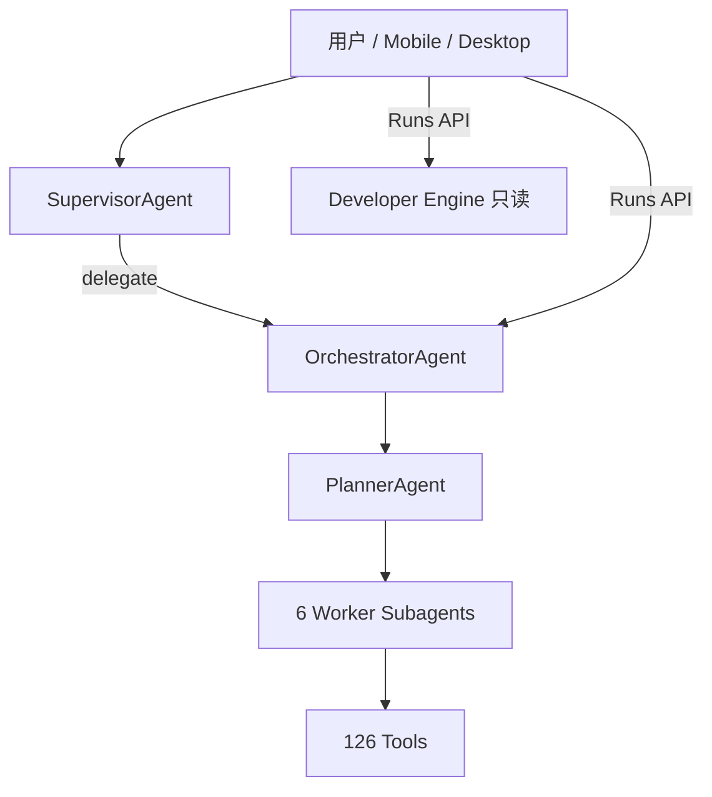

# Lengrvis/mavris Round 6 审计终报 — 项目实际 Agent 能力

**审计日期：** 2026-06-12  
**仓库路径：** c:\Users\Suli\Desktop\mavris  
**审计对象：** 工作树当前磁盘代码 — Agent 编排、工具注册、执行引擎、回归覆盖  
**审计类型：** 能力真实性审计（Capability Truth Audit）  
**方法：** 代码路径追踪 + 工具注册表枚举（126 内置工具）+ golden tasks 覆盖对照 + 执行链静态验证  
**基线：** `.cursor/audit-r5-final-report.md`（2026-06-12，代码质量总评 74/C+）

---

## 1. 中文执行摘要

Round 6 不重复 R5 的代码质量/security 审查，而是回答一个产品级问题：**用户以为 Agent 能做什么，与运行时实际能做什么，是否一致？**

**核心结论：不一致。** 项目实现的是 **单 Orchestrator 分层编排**（1 入口 Supervisor + 1 编排器 + 6 个 tool-bound Worker + 多层 Review），**不是**多 Agent 平等协作或「委派即由该 Agent 规划」。内置 **126 个工具**，但 golden 回归（34 条）仅覆盖 **系统 / 文件 / 文档 / 审批 / 安全** 等本地 OS 助手路径；**浏览器、联网搜索、远程输入、UI 自动化、Developer Engine 写代码、Skill/MCP 扩展** 等占工具总量约一半的能力 **零 golden 覆盖**。

**Agent 能力成熟度：68 / 100（C）**

| 等级 | 含义 |
|------|------|
| **可对外声称** | 本地系统诊断、授权目录内文件操作、文档分析、应用管理、工具级审批 |
| **代码存在但未证** | 浏览器自动化、Web 搜索、远程桌面输入、Windows GUI 自动化 |
| **不应声称** | Developer Engine 自主改代码；Supervisor 显示的 target Agent 即实际规划者；默认 Skill 扩展 |

**较 R5 关系：** R5 证明编排 **可靠**（C1/C2 已修、42 项守护 pytest 全绿）；R6 证明编排 **能力边界与产品表述存在 gap** — 可靠性 ≠ 能力已验证。

---

## 2. 审计范围与方法

### 2.1 范围

| 纳入 | 排除 |
|------|------|
| `backend/app/agents/`（17 Agent 类） | R5 已覆盖的 SSRF/DB 死锁等基础设施项 |
| `backend/app/tools/` + `register_all_tools` | Desktop/mobile UI 视觉 QA |
| `backend/app/orchestration/` 执行链 | 第三方 LLM 模型质量 |
| `backend/app/services/task_service.py` 委派链 | |
| `test_data/golden_tasks/golden_tasks.json` | |
| Developer / OS 双引擎路由 | |

### 2.2 方法

1. **注册表枚举：** 运行 `register_all_tools(load_skills=True/False)`，按 `agent_owner` 分组统计。
2. **路径追踪：** 从 `handle_chat` / `create_run` 追踪至 Planner → Scheduler → StepExecution → ToolRuntime。
3. **Golden 对照：** 34 条 golden task 的 `category` / `plan_tools` / `entry` 与工具域映射。
4. **名义 vs 实际：** 核对 `agent_hint`、`agent_name`、UI 响应字段是否进入规划输入。

### 2.3 证据等级

| 等级 | 定义 |
|------|------|
| **A** | golden task 或定向 pytest 守护 |
| **B** | 单元/集成测试存在但无端到端 golden |
| **C** | 仅代码与 prompt 声明，无自动化回归 |
| **D** | 代码明确不支持或 UI/命名误导 |

---

## 3. Agent 资产清单

### 3.1 运行时拓扑（实测结构）

```
用户输入
  ├─ Chat API → SupervisorAgent.decide() → [chat | delegate]
  │       delegate → OrchestratorAgent → PlannerAgent → … → ToolRuntime
  └─ Runs API → EngineRouter
          ├─ OS Engine → OrchestratorAgent 全栈（126 工具）
          └─ Developer Engine → Lengrvis Code 子进程（只读 allowlist）
```

### 3.2 十七 Agent 类 — 角色与执行权

| 类名 | 层 | 能否执行用户 step 工具 | 注册于 Orchestrator.subagents |
|------|-----|------------------------|-------------------------------|
| SupervisorAgent | 入口 | 否 | — |
| OrchestratorAgent | 编排 | 间接（经 handler） | — |
| PlannerAgent | 编排 | 否（仅产出 Plan） | 否 |
| FileAgent | Worker | **是** | ✅ |
| ComputerAgent | Worker | **是** | ✅ |
| DocumentAgent | Worker | **是** | ✅ |
| BrowserAgent | Worker | **是** | ✅ |
| SearchAgent | Worker | **是** | ✅ |
| AppAgent | Worker | **是** | ✅ |
| SafetyReviewAgent | Review | 否 | 否（orchestrator.safety） |
| ParallelReviewAgent | Review | 否 | 否 |
| BrowserActivityReviewAgent | Review | 否 | 否 |
| CleanupReviewAgent | Review | 否 | 否 |
| HumanGateAgent | Meta | 否（仅 bus 文案） | 否 |
| MemoryAgent | Meta | 否 | 否 |
| CodeReviewAgent | Dev gate | 否（开发期 PR 审查） | 否 |

**证据：** Worker 仅 6 个写入 `orchestrator_agent.py:71-78` subagents 字典。

### 3.3 工具归属（126 内置，load_skills=False）

| agent_owner | 工具数 | 代表命名空间 |
|-------------|--------|--------------|
| ComputerAgent | 42 | `system.*`, `dev.*`, `remote.*`, `ui_automation.*`, `workflow.*` |
| FileAgent | 26 | `file.*`, `image.*` |
| BrowserAgent | 21 | `browser.*` |
| DocumentAgent | 18 | `document.*`, `vision.*` |
| AppAgent | 12 | `app.*` |
| SearchAgent | 4 | `search.*`, `tool.search` |
| ExternalServices | 3 | `external.*` |
| **合计** | **126** | load_skills=True 时仍为 **126**（默认 0 skill 工具） |

---

## 4. 实测与对照结果

| 检查项 | 结果 |
|--------|------|
| 内置工具总数 | **126** |
| 默认 Skill 工具数 | **0** |
| Golden task 总数 | **34** |
| Golden 覆盖 category | system(5), cleanup(2), approval(5), safety(7), file(5), app(1), chat(3), files_api(3), document(3) |
| Golden **未**覆盖域 | browser, search, remote, ui_automation, dev, developer-engine, workflow, external, skill, mcp |
| Planner 确定性短路 | **6** 条（cleanup / file.trash / uninstall / system.diagnostics / open_app / file.search_by_name） |
| Developer Engine writes_enabled | **False**（`developer_engine.py:71`） |
| Developer 禁止工具 | Write, Edit, Bash, Agent（`integrations/lengrvis_code.py:39`） |
| R5 编排守护 pytest | **42/42 PASSED**（与能力无关，证明执行链可靠） |

---

## 5. 发现项（按严重度）

### 5.1 High — 产品能力表述与实现不符

**R6-H1 — Supervisor `agent_hint` 不驱动规划，UI「委派给 X Agent」易误导**  
| 字段 | 内容 |
|------|------|
| 状态 | **OPEN** |
| 证据 | `task_service.py:145-173` 仅 audit + `ChatResponse.agent`；`PlannerAgent.create_plan()` 无 `agent_hint` 参数（`planner_agent.py:111-122`） |
| 影响 | 用户/mobile 看到「已交给 FileAgent」，Planner 仍可能生成 BrowserAgent 步骤或不同工具链 |
| 证据等级 | **D**（名义 ≠ 实际） |
| 修复 | 将 hint 注入 planner context；或 UI 改文案为「已创建任务，由编排器规划」 |

**R6-H2 — Developer Engine 不能自主改代码，与「开发 Agent」品牌预期不符**  
| 字段 | 内容 |
|------|------|
| 状态 | **OPEN（by design，需披露）** |
| 证据 | `developer_engine.py:71` `writes_enabled: False`；allowlist 禁 Write/Edit/Bash；`engine_router.py:114-118` 写意图 dev 目标强制回 OS 审批路径 |
| 影响 | 用户「帮我修这个 bug」若路由到 developer 引擎，仅只读分析 |
| 证据等级 | **D** |
| 修复 | 产品文档/UX 明确「只读代码分析」；或产品决策放开 writes + 审批 |

### 5.2 Medium — 能力存在、回归缺失

**R6-M1 — BrowserAgent 21 工具零 golden**  
| 字段 | 内容 |
|------|------|
| 状态 | **OPEN** |
| 证据 | 工具注册 `browser_tools.py`；golden_tasks.json 无 `browser.` plan_tools |
| 影响 | 浏览器自动化能力无法 CI 证明，回归风险高 |
| 证据等级 | **C** |
| 修复 | 增 3–5 条 mock/stub golden（如 read_page、navigate read-only） |

**R6-M2 — SearchAgent / 联网搜索零 golden**  
| 字段 | 内容 |
|------|------|
| 状态 | **OPEN** |
| 证据 | `search_tools.py` 注册 3 工具 + `tool.search`；golden 无 `search.query` |
| 证据等级 | **C** |

**R6-M3 — remote.* / ui_automation.* 零 golden（ComputerAgent 42 工具中占多数未证）**  
| 字段 | 内容 |
|------|------|
| 状态 | **OPEN** |
| 证据 | `remote_tools.py`, `ui_automation_tools.py`；mobile RemoteScreen 有 smoke，无 golden |
| 证据等级 | **C** |

**R6-M4 — ComputerAgent 合并 system/dev/remote/ui/workflow，域边界模糊**  
| 字段 | 内容 |
|------|------|
| 状态 | **OPEN** |
| 证据 | `computer_agent.py:13-20` allowed_tools 扩展 remote/ui_automation；与 Developer Engine 双轨 dev 能力并存 |
| 影响 | 规划器/agent_owner 路由复杂，故障难归因 |
| 证据等级 | **C** |

**R6-M5 — Skill 框架完整、默认空载**  
| 字段 | 内容 |
|------|------|
| 状态 | **OPEN** |
| 证据 | `register_all_tools(load_skills=True)` → 仍 126 工具；test_data/skills 未进默认配置 |
| 证据等级 | **C** |

**R6-M6 — MCP 扩展非默认开箱能力**  
| 字段 | 内容 |
|------|------|
| 状态 | **OPEN** |
| 证据 | `mcp/registry.py` 运行时适配；取决于 settings.mcp_servers 配置 |
| 证据等级 | **C** |

### 5.3 Low

| ID | 项 | 证据 | 状态 |
|----|-----|------|------|
| R6-L1 | HumanGateAgent 无独立决策，仅审批文案 | `human_gate_agent.py`；`tool_runtime.py:766` | OPEN（命名） |
| R6-L2 | CodeReviewAgent 不在用户任务主链 | `review_gate.py` | 信息 |
| R6-L3 | 并行执行仅限只读 concurrency-safe 步骤 | `parallel_review_agent.py:33-40` | by design |
| R6-L4 | privacy mode 失败不 mock fallback，能力降级为硬失败 | `planner_agent.py:176-193` | by design |

### 5.4 已验证能力（正面发现）

| ID | 能力 | 证据等级 | 守护 |
|----|------|----------|------|
| R6-OK-1 | 系统诊断（中英文） | **A** | golden system×5 |
| R6-OK-2 | 文件搜索/删除审批/清理预览 | **A** | golden file/cleanup/approval |
| R6-OK-3 | 文档 summarize/qa/extract | **A** | golden document×3 |
| R6-OK-4 | 安全策略与路径沙箱 | **A** | golden safety×7 |
| R6-OK-5 | Worker owner 不匹配则 request_revision | **B** | `base.py:133-139` + 单元逻辑 |
| R6-OK-6 | 6 条 Planner 确定性计划 | **A** | golden 命中多条 |
| R6-OK-7 | 工具级审批 + desktop/mobile UI | **A** | golden approval×5 |

---

## 6. 能力成熟度评分

### 6.1 维度得分

| 维度 | 权重 | 得分 | 说明 |
|------|------|------|------|
| 工具覆盖面 | 25% | **82** | 126 工具，域齐全 |
| 编排可靠性 | 20% | **74** | 继承 R5；PlanStep 隔离 ✅ |
| 路由/表述准确性 | 20% | **58** | agent_hint 不驱动规划 |
| 回归可证性 | 25% | **62** | 34 golden；大半工具域空白 |
| 扩展性（Skill/MCP/Dev） | 10% | **55** | 框架在、默认弱 |

**加权总分：68.0 → 68 / 100（C）**

### 6.2 计分规则

- 无 OPEN High 时不封顶（R6-H1/H2 为**产品披露类** High，非安全 Critical）。
- 若对外 marketing 声称「全栈自主 Agent」而未收敛 scope，建议能力分 **≤60** 直至 R6-M1–M3 golden 补齐。

---

## 7. Golden 覆盖矩阵

| 工具域 | 工具数 | Golden | 覆盖率（任务级） |
|--------|--------|--------|------------------|
| system | 12 | 5 | 高 |
| file / image | 26 | ~8 | 中 |
| document / vision | 18 | 3 | 低 |
| app | 12 | 1 | 低 |
| browser | 21 | 0 | **无** |
| search | 4 | 0 | **无** |
| remote | 4 | 0 | **无** |
| ui_automation | 20 | 0 | **无** |
| dev (OS) | 9 | 0 | **无** |
| workflow | 1 | 0 | **无** |
| external | 3 | 0 | **无** |

---

## 8. 执行引擎能力边界

### 8.1 OS Engine（主路径）

- **入口：** Chat delegate、`create_run(engine=os)`、系统诊断关键词路由  
- **能力：** 126 工具 + 审批 + 路径沙箱 + 并行只读 batch  
- **Planner：** 6×确定性短路 → LLM structured plan → consult → safety review plan  

### 8.2 Developer Engine

| 属性 | 值 |
|------|-----|
| 路由条件 | 只读 dev 关键词且无 OS 关键词（`engine_router.py:126-130`） |
| 实际能力 | Lengrvis Code 子进程：Read/Grep/Glob/受限 git·pytest bash |
| 写能力 | **关闭** |
| Golden | **0** |

---

## 9. 优先修复建议

| 优先级 | ID | 动作 |
|--------|-----|------|
| **P1** | R6-H1 | `agent_hint` 注入 Planner 或改 UI 文案 |
| **P1** | R6-H2 | 对外能力声明文档：Developer = 只读分析 |
| **P2** | R6-M1/M2 | browser + search 各 3–5 条 offline golden |
| **P2** | R6-M3 | remote/ui_automation mock golden 或 CI smoke |
| **P3** | R6-M4 | ComputerAgent 域拆分或 planner 路由文档化 |
| **P3** | R6-M5 | 默认 ship 1–2 showcase skill + golden |
| **P4** | R6-M6 | MCP 配置指南 + 1 条集成 golden |

---

## 10. 产品发布就绪（Agent 能力维度）

| 门槛 | 状态 | 说明 |
|------|------|------|
| 本地 OS 助手（文件/系统/文档） | ✅ | golden + R5 可靠性 |
| 浏览器 / 搜索 Agent | ⚠️ | 代码有，**未证** |
| 远程控制 / GUI 自动化 | ⚠️ | 代码有，**未证** |
| 自主改代码 | ❌ | Developer Engine 明确不支持 |
| Skill / MCP 开箱扩展 | ❌ | 需配置，默认空载 |
| UI 委派表述准确 | ❌ | R6-H1 OPEN |

**结论：** 以 **「本地 OS 助手 + 审批门控」** 定位可进内测/RC；以 **「全栈多 Agent 自主助手」** 定位需先完成 P1–P2 能力与表述收口。

---

## 11. 架构参考图



---

## 12. 附件索引

| 文件 | 说明 |
|------|------|
| `.cursor/audit-r6-final-report.md` | 本终报 |
| `.cursor/audit-r6-agent-capabilities.md` | 能力审查详表（与终报同步） |
| `.cursor/audit-r5-final-report.md` | 代码质量基线 |
| `test_data/golden_tasks/golden_tasks.json` | 34 条回归数据集 |
| `backend/app/agents/orchestrator_agent.py` | subagents 注册 |
| `backend/app/tools/registry.py` | 工具注册入口 |

---

## 13. R5 → R6 关系说明

| 轮次 | 回答的问题 | 总评 |
|------|------------|------|
| R5 | 代码是否可靠、安全、可维护？ | 74 / C+ |
| R6 | Agent **实际能做什么**、是否与产品表述一致？ | 68 / C |

两轮互补：**R5 绿 ≠ R6 能力已证。** 建议在 PR/发布说明中同时引用 R5（工程质量）与 R6（能力边界）。

---

*Round 6 Agent 能力审计 | 2026-06-12*
